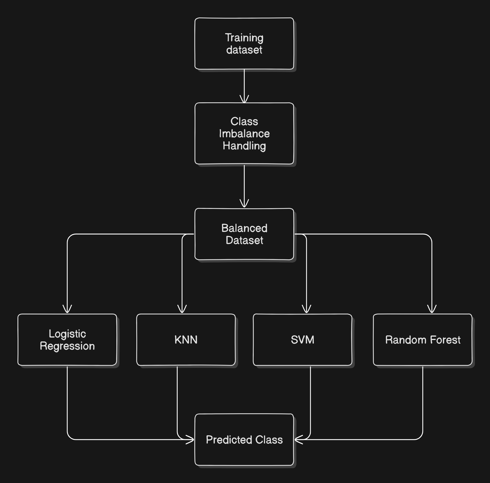

[](https://www.python.org/)
[](https://opensource.org/licenses/MIT)
[](https://github.com/Chandan24-cell/HaemaScan-Visual-Anaemia-Detection-System)

# HaemaScan: Visual & Clinical Anemia Detection System
<div align=\"center\">
  <i>An intelligent, dual‑approach diagnostic support platform combining non‑invasive visual analysis with clinical blood parameter evaluation.</i>
</div>

## 📌 Introduction

Anemia affects billions of people worldwide, yet it often remains undiagnosed due to limited access to laboratory testing. HaemaScan bridges this gap by offering a dual‑diagnostic engine that delivers fast, accessible, and reliable anemia risk assessment:

- **Visual Fusion Analysis** – Uses computer vision to analyse physiological markers in the palm, nail bed, and conjunctiva.
- **Clinical Laboratory Analysis** – Employs validated machine learning models on traditional blood profile metrics (Hb, MCV, MCH, MCHC, etc.).

diagnostic confidence.

### Demo & Screenshots




## 🚀 Key Features

- **Non‑Invasive Screening** – Instant risk assessment using standard smartphone photographs.
- **Multi‑Point Visual Analysis** – Simultaneous evaluation of three vascular regions (palm, nail, conjunctiva) to minimise lighting and physiological variations.
- **Clinical Parameter Analysis** – Machine learning models trained on haematological datasets for secondary validation.
- **High‑Confidence Metrics** – Real‑time percentage‑based risk scores and confidence levels.
- **Glassmorphism UI** – Clean, modern web interface with asynchronous data fetching.

## 🧠 Methodology

HaemaScan employs a multi‑model fusion architecture to ensure diagnostic robustness. The system processes visual and clinical data through two independent pipelines, whose outputs can be correlated for enhanced confidence.

### 1. Visual Analysis (Multi‑Model Fusion)

Instead of relying on a single image, the visual pipeline processes three inputs in parallel:

**Feature Extraction** – Three separate vision models (built with TensorFlow / PyTorch) extract physiological markers:

- **Palm**: colour intensity, pallor patterns
- **Nail bed**: capillary refill, nail colour
- **Conjunctiva**: redness, texture of the inner eyelid

**Model Fusion** – The feature vectors from the three models are aggregated (e.g., concatenation + dense layers) to produce a unified probability score.

**Inference** – A final classification of “Anemic” or “Not Anemic” is generated, together with a confidence percentage. This fusion approach reduces noise caused by variable lighting or individual anatomical differences.

### 2. Clinical Laboratory Analysis

For users who have access to blood test results, HaemaScan provides a secondary analytical pipeline:

- **Data Preprocessing** – Standardised haematological metrics (haemoglobin, MCV, MCH, MCHC) are scaled and fed into a classifier.
- **Model** – A Random Forest Classifier was selected after benchmarking several algorithms. It handles non‑linear relationships in clinical data effectively.
- **Class Imbalance Handling** – SMOTE (Synthetic Minority Oversampling Technique) was applied during training to ensure reliable performance on both healthy and anemic samples.

## 📊 Model Performance

The Random Forest model was chosen for deployment due to its superior performance on the clinical dataset. The table below compares it with other common classifiers:

| Algorithm              | Accuracy | ROC‑AUC |
|------------------------|----------|---------|
| Random Forest          | 99%      | 99%     |
| Logistic Regression    | 98%      | 98%     |
| Support Vector Machine | 90%      | 90%     |
| K‑Nearest Neighbors    | 87%      | 87%     |

The visual fusion model achieves a confidence score > 90% on test images captured under controlled conditions. Both models output a unified risk percentage and a confidence metric in the final response.

## 🛠️ Technical Stack

- **Core Language**: Python 3.8+
- **Web Framework**: Flask (handles API routing and model inference)
- **Machine Learning**: Scikit‑learn, TensorFlow, NumPy, Pandas
- **Image Processing**: Pillow (PIL), OpenCV
- **Frontend**: HTML5, CSS3 (Glassmorphism), Vanilla JavaScript
- **Authentication & Data Storage**: Supabase (Backend‑as‑a‑Service)
- **Deployment**: Gunicorn (production), Docker (optional)

## 📋 API Integration (Multi‑Model Endpoint)

The system exposes a POST endpoint `/api/vision-predict` that accepts three image files. This endpoint triggers the visual fusion pipeline.

**Request Format (multipart/form‑data):**

```
palm – image file of the palm
nail – image file of the nail bed
conjunctiva – image file of the conjunctiva
```

**Successful Response (JSON):**

```json
{
  \"success\": true,
  \"prediction\": \"Anemic\",
  \"anemia_risk\": 78.5,
  \"confidence\": 92.0
}
```

The `anemia_risk` represents the probability of being anemic, while `confidence` reflects the model’s certainty (based on feature agreement among the three views).

## ⚡ Quick Start
```bash
git clone https://github.com/Chandan24-cell/HaemaScan-Visual-Anaemia-Detection-System.git && cd HaemaScan-Visual-Anaemia-Detection-System
python -m venv venv && source venv/bin/activate
pip install -r requirements.txt
cp .env.example .env  # Edit with your API keys
python app.py
```
**Open**: http://localhost:5000

### Docker
```dockerfile
# Use Dockerfile in repo
docker build -t haemascan .
docker run -p 5000:5000 --env-file .env haemascan
```

### Vercel/Render/Heroku
Set `PORT` env var and `Procfile: web: gunicorn app:app`

## 📂 Project Structure

```
HaemaScan/
├── app.py                 # Main Flask application
├── utils.py               # Helper functions (image processing, data scaling)
├── model/                 # Saved ML models (.pkl, .h5)
│   ├── random_forest_classifier.pkl
│   └── vision/
│       ├── palm_model_saved/
│       ├── nail_model_saved/
│       └── eye_model_saved/
├── static/                # CSS, JavaScript, images
│   ├── style.css
│   └── style_v2.css
├── templates/             # HTML templates
│   ├── index.html
│   └── login.html
├── requirements.txt       # Python dependencies
└── README.md              # This file
```

## ⚠️ Medical Disclaimer

HaemaScan is intended for **research and demonstration purposes only**. It is not a substitute for professional medical diagnosis, laboratory blood work (Complete Blood Count), or the advice of a qualified healthcare provider. Always consult a physician for any health concerns or before making medical decisions.

## 👥 Development Team

- Chandan Kumar Sah (II AIML)
- Rakesh Rauniyar (II CSE-D)
- Yogesh Raj Sah (II CSE-D)
- Sushil Kumar Patel (II CSE-D)

Project developed under the guidance of KPRIET.

## 📄 License

This project is open‑source and available under the [MIT License](LICENSE).
Feel free to use, modify, and distribute it as per the license terms.

